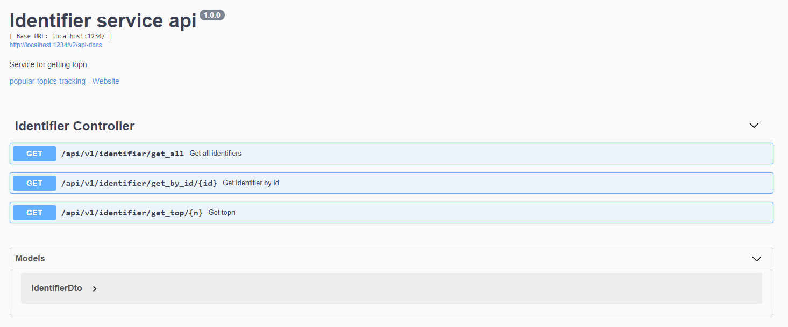

# Отслеживание популярных тем, постов и товаров в потоке данных на Apache Flink

Popular-topics-tracking представляет собой реализацию проекта «Отслеживание популярных тем, постов и товаров в потоке данных на Apache Flink» в рамках зимней школы [CompTech School 2022](https://comptechschool.com/).

- docs - документация проекта

- src - код проекта

- pom.xml - информация о деталях проекта

## Назначение

Реализация эффективной по памяти версии аппаратора, которая отслеживает наиболее популярные элементы в потоке данных. 

## Принцип работы

Используя `Apache Flink`, обрабатываем поток данных для дальнейшей возможности формирования наиболее популярных идентификаторов. Для этого используются HTTP запросы на сервис. Поток данных, в результате обработки, преобразуется в кортеж данных и записывается в нереляционную базу данных (`Cassandra`), откуда сервис получает данные, необходимые конечному пользователю или другому сервису. Реализация обработки потока с использованием рандомизированных алгоритмов позволяет занимать минимум памяти системы даже при больших объёмах данных.

## Использование продукта

Формирование данных на различных платформах для отображения наиболее популярных элементов. Примеры: YouTube(Раздел "Тренды"), Instagram(Раздел "Популярное").

## Установка и настройка

- `git clone https://github.com/comptech-winter-school/popular-topics-tracking.git`

- [Apache Kafka](https://kafka.apache.org/)

- [Apache Cassandra](https://cassandra.apache.org/)

В файле `config.properties` указать следующие параметры:

- filter.action-type - тип событий, для которых необходимо считать topN
- kafka.bootstrap-server - ip-адрес kafka сервера
- kafka.input-topic - kafka топик из которого поступают идентификаторы
- kafka.group-id - kafka group id

В файле `application.properties` указать следующие параметры:

- server.port - порт приложения
- spring.data.cassandra.contact-points - ip-адрес cassandra сервера
- spring.data.cassandra.keyspace-name - keyspace базы данных в cassandra

### Зависимости

Необходимые зависимости указаны в файле `pom.xml`

## Использование

Наш сервис предоставляет rest-api, ознакомиться подробнее в формате swagger можно [здесь](https://app.swaggerhub.com/apis-docs/Popov-Dmitry/popular-topics-tracking/1.0.0#/).

## Команда

- Екименко Евгений – разработчик [@EvgeniyEkimenko](https://github.com/EvgeniyEkimenko)

- Попов Дмитрий – разработчик [@Popov-Dmitry](https://github.com/Popov-Dmitry)

- Кононова Полина – технический писатель [@polina-kononova](https://github.com/polina-kononova)

## Кураторы

Рене Андреасович ван Беверн - эксперт, Новосибирский Исследовательский центр ООО "Техкомпания Хуавей"

Антон Георгиевич Логинов - старший инженер, Новосибирский Исследовательский центр ООО "Техкомпания Хуавей"

